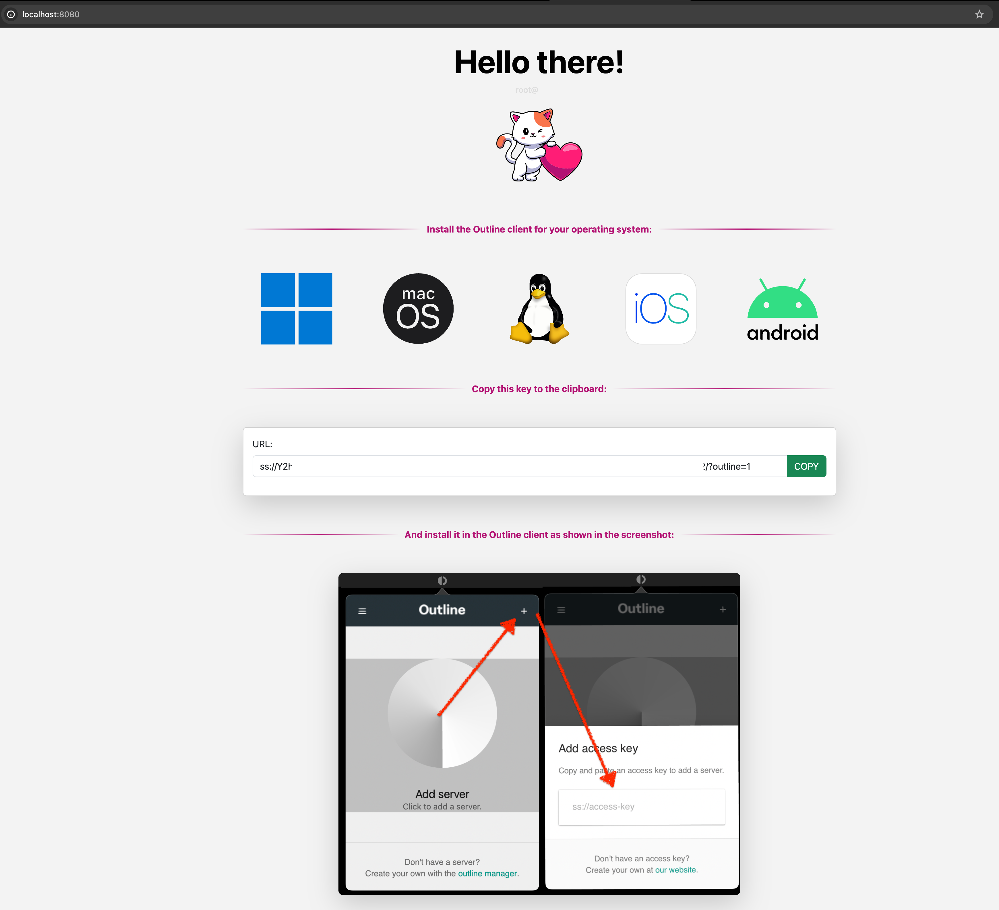

# Deployment Instructions

```sh
$ cp docker-compose.yml docker-compose.prod.yml
$ vim docker-compose.prod.yml
```
[add secrets]
```sh
$ docker compose -f docker-compose.prod.yml up -d
```
service available on http://localhost:4180


